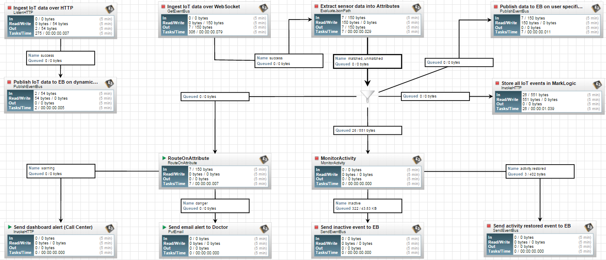

iot-activity-tracker
====================

1. Ingest IoT data over HTTP
    1. Open HTTP server on port 5001 and listen for HTTP `POST` requests.
    2. Add HTTP headers (`sensor`) to flowFile attributes. 
    2. Publish HTTP payload to **EventBus**'s dynamic address `iot.in.${sensor}`.
2. Ingest IoT data over WebSocket.
    1. Open EventBus-WebSocket bridge on port 5555.
    2. Let external (JavaScript), and internal(ListenHTTP) clients to publish IoT events including headers(`sensor`) to dynamic address `iot.in.${sensor}`.
    3. Extract sensor data from JSON payload into flowFile attributes for future use.
3. Send all IoT data to MarkLogic and HDFS(W.I.P) for historical data search. 
4. Route Heart rate IoT data to `warning` and `danger` routes
    1. `danger` route will send email alert to Doctor.
    2. `warning` route will send dashboard alert (Call Center).
4. Inactivity Reporting
    1. Send `Inactivity Message` when there is no IoT data in the flow for 5 min.
    2. Send `Activity Restored Message` when new IoT data received after inactivity event. 
    3. Client UI can subscript to `Inactivity` events and show graphical status. 
       
Note: this flow depends on **nifi-websocket** module, download [nar](https://github.com/xmlking/nifi-websocket/releases/download/0.1.0/nifi-websocket-0.1.0-SNAPSHOT.nar) and copy to `$NIFI_HOME/lib`

### Run
1. Send test IoT data via dashboard 
    > Access [this](./dashboard/heartrate.html) page and submit the form. 
2. Send test IoT data via CURL
```bash
curl ....
```

### Demo


### Flow


### Reference 
