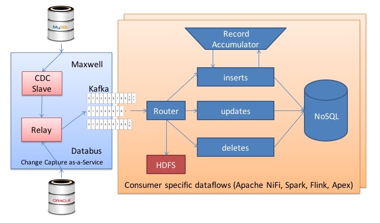

oltp-cdc-olap
=============

A low latency, multi-tenant *Change Data Capture(CDC)* pipeline to continuously replicate data from **OLTP(**MySQL**)** to **OLAP(**NoSQL**)** systems with no impact to the source. 


1. Capture changes from many Data Sources and types.
2. Feed data to many client types (real-time, slow/catch-up, full bootstrap).
3. Multi-tenant: can contain data from many different databases, support multiple consumers. 
4. Non-intrusive architecture for change capture.
5. Both batch and near real time delivery.
6. Isolate fast consumers from slow consumers.
7. Isolate sources from consumers
    1. Schema changes
    2. Physical layout changes
    3. Speed mismatch
8. Change filtering
    1. Filtering of database changes at the database level, schema level, table level, and row/column level.
9. Buffer change records in **Kafka** for flexible consumption from an arbitrary time point in the change stream including full bootstrap capability of the entire data.
9. Guaranteed in-commit-order and at-least-once delivery with high availability (`at least once` vs. `exactly once`)
10. Resilience and Recoverability
12. Schema-awareness 
  
### Setup

#### Install and Run MySQL
Install source MySQL database and configure it with row based replication as per [instructions](./mysql/README.md). 

#### Install and Run Kafka
Follow the [instructions](./kafka/README.md)

#### Install Maxwell 
```bash
cd oltp-cdc-olap/maxwell
curl -L -0 https://github.com/zendesk/maxwell/releases/download/v0.13.1/maxwell-0.13.1.tar.gz | tar --strip-components=1 -zx -C .
```

### Run

   `cd maxwell`

1. Run with stdout producer 

   `bin/maxwell --user='maxwell' --password='XXXXXX' --host='127.0.0.1' --producer=stdout`
2. Run with kafka producer

   `bin/maxwell`
    
### Test
If all goes well you'll see maxwell replaying your inserts:

```sql
mysql> CREATE TABLE test.guests (
         id INT(6) UNSIGNED AUTO_INCREMENT PRIMARY KEY,
         firstname VARCHAR(30) NOT NULL,
         lastname VARCHAR(30) NOT NULL,
         email VARCHAR(50),
         reg_date TIMESTAMP
       )
mysql> INSERT INTO test.guests SET firstname='sumo', lastname='demo';
Query OK, 1 row affected (0.04 sec)

(maxwell)
{"database":"test","table":"guests","type":"insert","ts":1446422524,"xid":1800,"commit":true,"data":{"reg_date":"2015-11-02 00:02:04","firstname":"sumo","id":1,"lastname":"demo"}}
```

### Architecture


### Flow


### Reference 
1. [Maxwell's Daemon](http://maxwells-daemon.io/quickstart/)
2. [LinkedIn: Creating A Low Latency Change Data Capture System With Databus](http://highscalability.com/blog/2012/3/19/linkedin-creating-a-low-latency-change-data-capture-system-w.html)